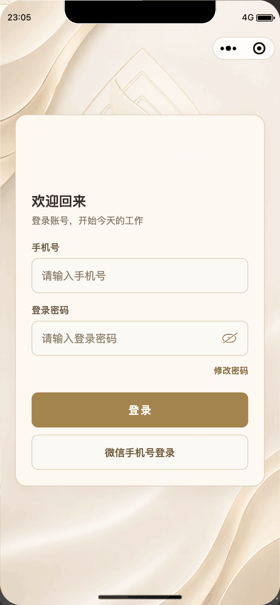

# 登录品牌动效重做 · 2026-09-05

用户反馈上一版动画效果差。本次保留原来的品牌色、背景图、品牌名、表单几何尺寸与登录行为，重新制作品牌入场。

- 移除背景缩放、两层扫光、圆框亮边和表单逐项淡入。
- 标志由两个等尺寸、反向运动的裁切视窗从下向上揭示，图像整体位置不变，无放大造成的临时模糊。
- 品牌名晚 180 毫秒从固定文字视窗升起，整段约 1.14 秒结束，终态恢复 `transform: none`。
- 背景、表单、输入框、按钮与提示从首帧起保持静止、完整可见。未改登录 JavaScript、启动会话复核、授权按钮、密码处理、错误提示或角色权限。
- 减少动态效果媒体查询覆盖全部三个动画节点，直接显示静态终态；没有动画计时器或新增依赖。

## 预览

预览为官方微信开发者工具 390×844 隔离小程序的原生 WXSS 时间轴采样：每 40 毫秒一个节点，共 31 个采样点，末帧停留后循环，便于比较。GIF 合并了两组相同画面，共 29 个编码帧、3 秒、189,651 字节；已核对编码总时长和最后一帧与原生采样的调色板转换结果一致。**小程序实际只播放一次。** 此演示不是实时录屏或真机帧率测量。

## 验证

- 仓库 `node --test tests/*.test.js`：289 项全部通过。
- 官方开发者工具成功编译隔离预览；该预览不加载业务服务、不调用登录、授权、短信或真实账号接口。
- 0、120、280、520、900、1200 毫秒共六帧：背景、卡片、提示、手机号、密码、两种登录按钮均无动画、无变换、透明度为 1，且各帧几何尺寸完全一致。
- 标志两层位移互相抵消；正常播放结束后全部动画节点回到静止位置。
- 动画开始后输入事件能更新示例值；密码显隐操作有效。输入、按钮与品牌均在页面内；两种登录按钮均为 302×49 像素，眼睛控制与密码框同高。
- [原生测量记录](assets/login-motion-rework/phone-checks.json)。已人工查看关键时间点截图，品牌终态完整、不重叠。
- 隔离预览已关闭，开发者工具已重新打开实际 `miniprogram-app` 项目。

限制：Mac 锁屏期间无法切换平板设备或人工连续观察当前动画，本轮未补做平板播放、系统减少动态效果设置或真机帧率验收。媒体查询的静态回退仅完成源码检查。原有平板尺寸规则保留，不能据此宣称本轮平板实测通过。

## 部署状态

本次仅包含小程序 WXML／WXSS 与文档。没有 SQL、云函数、网页版或依赖变更。源码推送与微信上传分开计算：本次动效尚未上传微信，最后确认上传成功的开发版本仍为 0.2.61，此前 0.2.64 上传超时；本次没有提交审核或正式发布。
