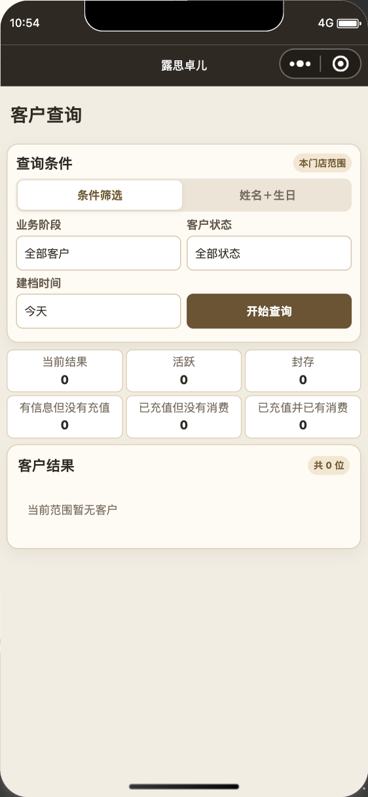
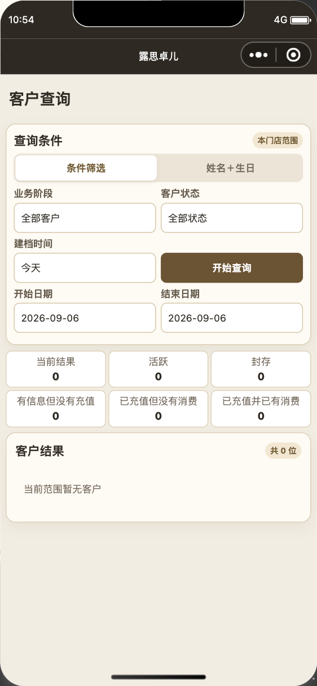
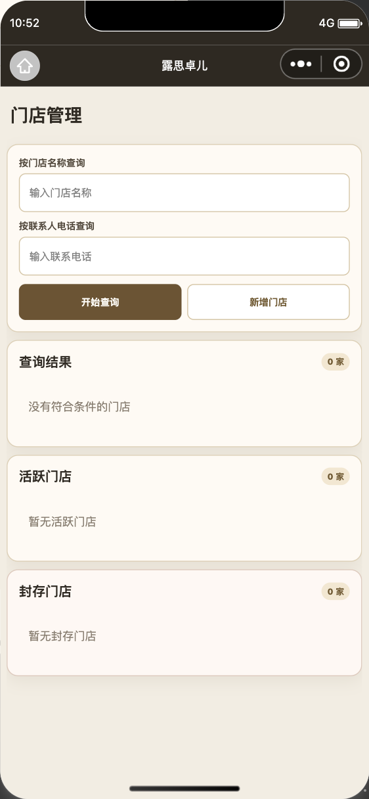
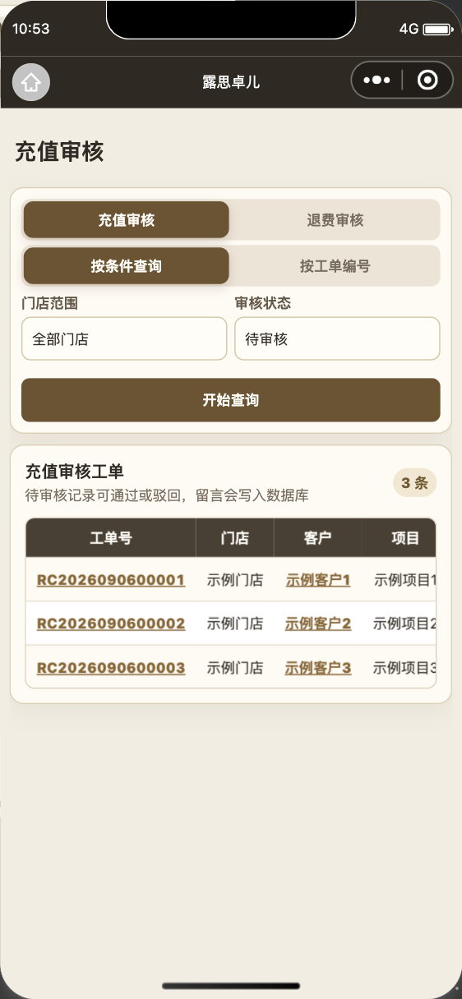

# 小程序全局布局与查询入口检查

日期：2026-09-06。承接老师客户独立页、门店汇总留白修复，按用户最新要求检查同类问题并精简查询按钮。仅修改小程序；没有 SQL、云函数或旧 Web 客户端变更。

## 改动

- 客户、充值／核销／产品查询、三类审核、活跃预警、余次预警、评价分析取消“重置／重置查询”，统一保留“开始查询”；总部首页移除“恢复默认”，继续按原筛选规则自动查询。密码重置、照片清除等独立业务操作保留。
- 客户查询的“建档时间／开始查询”固定一行，选择框与按钮等高；自定义起止日期在下一行并排。门店上方的业务阶段／客户状态保持并排，总部门店范围在手机独占一行。平板采用三个主筛选一行、时间与查询同排的紧凑尺寸。
- 审核页去掉重置后，手机查询按钮占满下一行，平板门店／状态／开始查询为同级三列，保留标签行对齐。
- 总部门店／老师管理的三张表原来仍将空提示放在表格内，已改为表格外全宽、左对齐、正常换行；加载和失败使用对应文案。
- 空或单页查询、预警、评价、首页与客户历史收起无效分页／跳页；多页保留原分页接口，当前页大于 1 时保留返回上一页的路径。
- 原生检查发现审核表中按钮加内边距会撑高数据行，三行时裁切约 4.5px、五行视口裁切约 8px。收紧操作单元格的上下内边距后，按钮完整显示且行高与视口一致。
- 客户历史视口仍按 76rpx 估算，而真实行高为 74rpx，五行时出现约 9px 额外高度；已同步行高。一般页面按钮补充父容器宽度限制，空提示补充字号、左对齐与换行规则。

## 覆盖与证据

全部 27 个注册页面完成表格空提示位置、固定高度及查询按钮的源码检查，页面清单见 [source-inventory.json](global-layout-review/source-inventory.json)。登录、创建、办理、工单、项目／产品模板等页面没有本次识别出的表格嵌套空态；不据此声称这些页面的全部业务功能已重新真机测试。

微信开发者工具以真实 WXML／WXSS、原页面初始数据和隔离的合成展示数据检查总部／门店页面。布局检查控制器只记录事件，不调用生产服务、不写数据库；不能替代线上权限或交易验证。覆盖客户查询、三类业务查询、三类审核、门店／老师目录、两类预警、评价分析、客户主页与老师管理主页的空结果、三行和六行状态。发现的高度问题修复后复查，检查过滤按钮边界、表格高度、空／单页分页，以及建档时间与查询按钮／自定义日期的对齐。

308 项仓库测试通过。老师独立客户页另有实际控制器的角色等待、请求竞态、分页、跳转和失败重试检查，见[老师客户页记录](2026-09-06-teacher-customer-page.md)。本次原生渲染视口为 390×753；Mac 锁定导致无法切换 iPad 预览，平板仅完成源码与现有布局合约检查，没有真机或 iPad 验收。

最终 60 个展示场景通过，合并的原生检查结果见 [native-checks.json](global-layout-review/native-checks.json)。开发版本上传、体验版与正式发布分别以发布记录为准。

