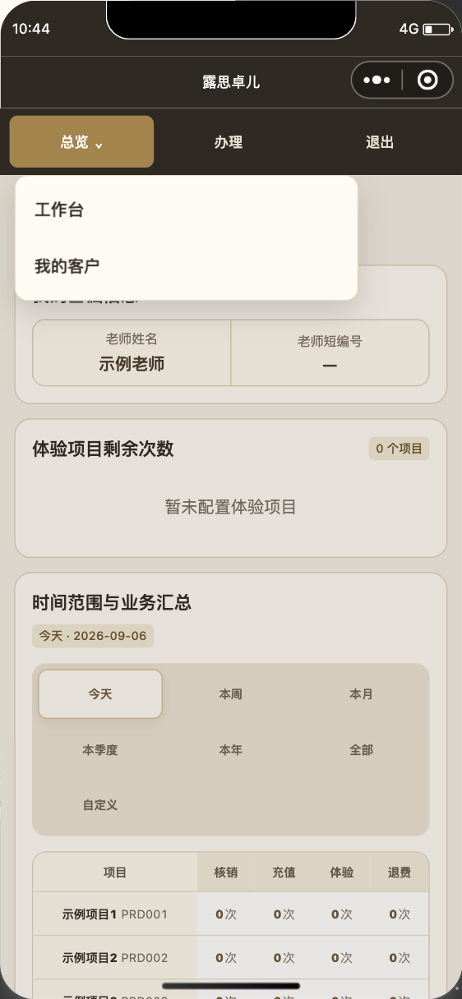
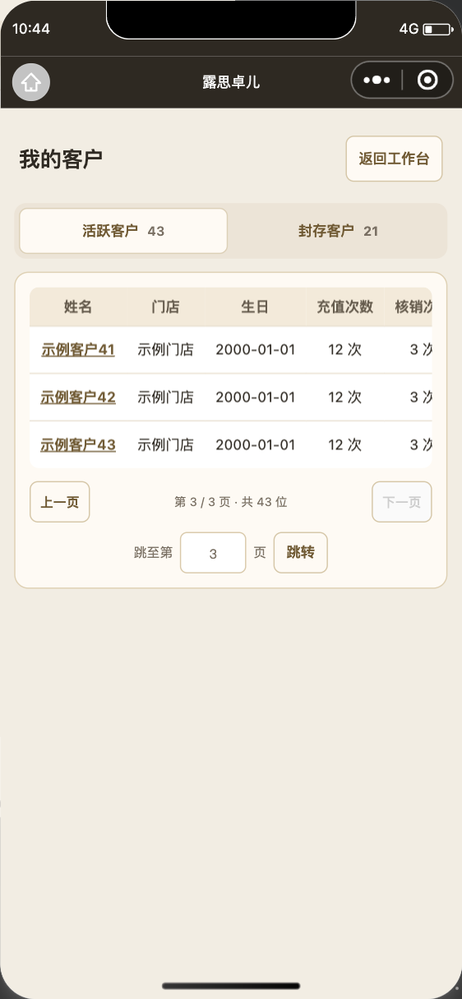
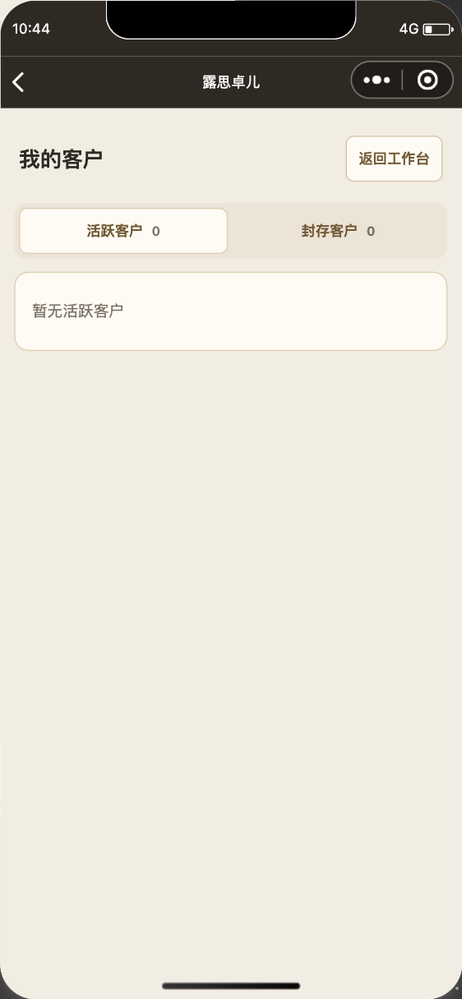
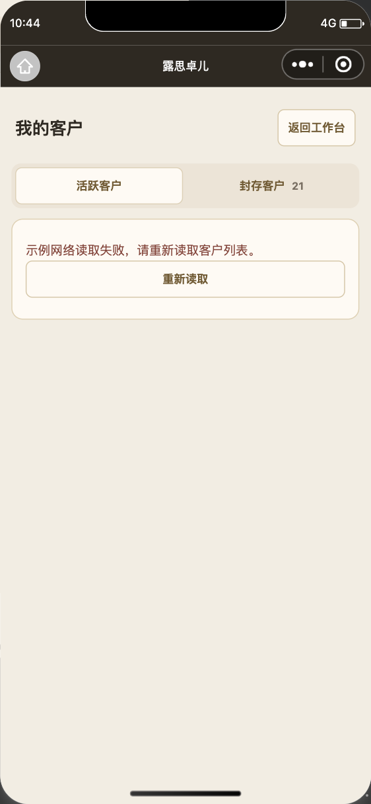
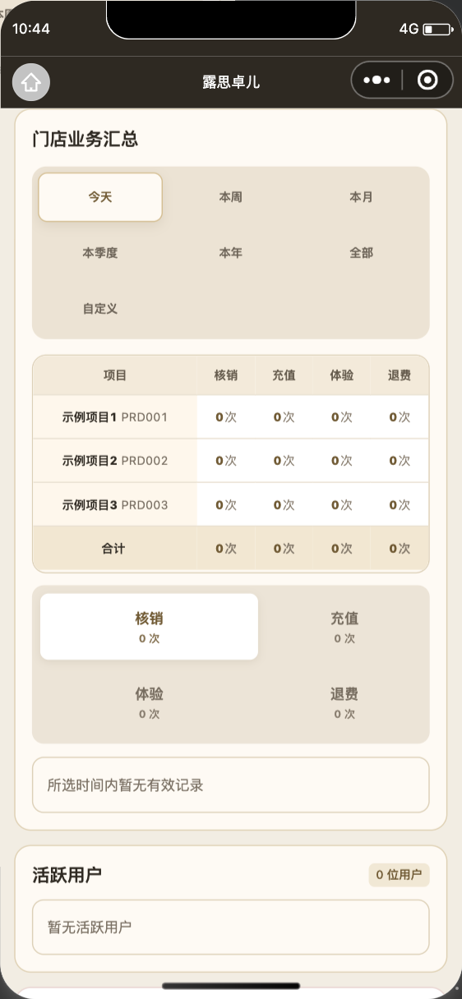

# 老师客户页与门店表格修复

日期：2026-09-06。仅修改微信小程序；沿用暖象牙白、浅香槟金与深咖配色。

老师首页将活跃／封存客户移至独立“我的客户”页，通过“总览 → 我的客户”进入。首页保留资料、体验额度、业务汇总和本人业务明细，不再请求客户目录。两个状态分别记住页码，每页最多 20 条；姓名仍进入已有客户主页，返回按钮回到工作台。新页等待启动会话完成并仅允许老师进入，沿用服务端按当前 UID 确定客户范围的接口，没有新增角色或跨门店身份参数。

门店账号首页和总部进入的门店主页保留两张客户表。本次将业务／客户空提示从表格第一列移出，改为全宽、左对齐和正常换行，同时隐藏空表头、分页与跳页输入。项目汇总视口按现有紧凑表头与行高收合，消除合计下方旧行高留下的空白。老师首页复用同样的汇总及业务空态修复。

新客户页区分读取中、确实为空和读取失败，失败清除旧列表并支持原页重试；快速切换状态时旧响应不能覆盖新状态，卸载后不再更新页面。分页按钮显式约束宽度，避免微信 style v2 默认按钮宽度挤压中间页码。

## 验证

- `node --test tests/*.test.js`：308 项通过。新增运行时检查覆盖启动会话／角色、独立页码、客户跳转、旧响应与卸载、异常响应重试和无效页码。
- 微信开发者工具隔离原生页面：390×753 视口，使用实际页面及样式与合成数据；没有连接生产客户服务、创建账号或写入业务记录。
- 点击老师“总览 → 我的客户”成功；首页没有客户表，也没有客户目录请求。活跃第 3 页／封存第 2 页相互切换后保留各自位置，错误重试仍回原页。
- 空列表不显示表格或分页。三条客户数据的分页按钮完整留在卡片内，页码不再竖排。
- 门店首页／总部进入的门店主页：三项项目加合计的实际表格高 181px、带边框视口 185px；三个空提示均宽 336px、左对齐、正常换行。没有预留原截图中的大片底部空白。
- 本次未进行真机或 iPad 验证，不把开发者工具结果当作手机验收或正式发布。

[原生检查数据](teacher-customer-page/native-checks.json)

本次没有 SQL、云函数或旧 Web 客户端改动。此前系统风险报告中的其他业务风险不在本次修复范围内；开发版本上传及正式发布状态以小程序发布记录为准。
